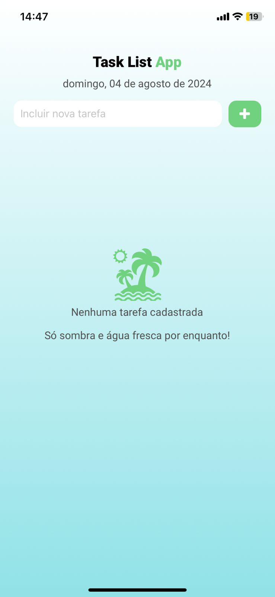

# Trilha Inicial Mobile Jr

Este projeto tem como objetivo principal desenvolver um aplicativo de lista de tarefas simples, que permita aos usuários adicionar, visualizar e marcar tarefas como concluídas.

## Tecnologias utilizadas

- React Native com Expo

## Imagens do projeto

  
  
  

## Instalação

- Clone o repositório
- `cd TaskListApp`
- Necessário ter o nodejs versão LTS instalada na máquina
- Necessário Android Studio
- Rodar comando `npm install` para instalar todas as dependências
- Rodar comando `npm start` para executar o projeto
- Pressione `a` para rodar no Emulador Android do Android Studio

## Abrir em um dispositivo físico

- Baixe o app Expo Go
- Escaneie com a câmera do dispositivo o QR code que aparece no terminal ao rodar o comando `npm start`
